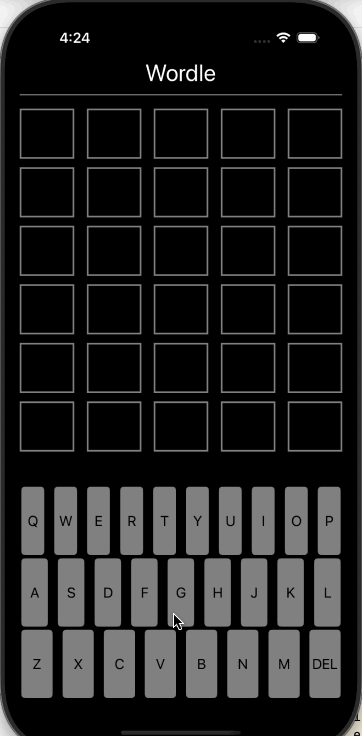

# Project 1 - Wordle 

Submitted by: Jay Noppone P 

Wordle is an app that lets you guess a word, and it will tell you which letters are correct or not.
If it is correct, full green means right position & letter, yellow means wrong position & correct letter

Time spent: 1.5hrs~ hours spent in total

## Required Features

The following **required** functionality is completed:

- [X] App displays a keyboard on the screen
- [X] When tapping on the keyboard, a letter is shown or deleted (letter selected)
- [X] User can play a basic version of Wordle, with different goal words each time

The following **optional** features are implemented:

- [X] Improve and customize the user interface by adding a launchscreen and app icon
- [X] Run the app on a device rather than in the simulator

The following **additional** features are implemented:

- [X] List anything else that you can get done to improve the app functionality!

## Notes

Was not reading documentation at my first attempt at this so made many mistakes, and was clueless on what I was doing.  
Things got better when I actually read the docs and tried to understand what each function or method did, or what a closure does and how to use it properly.

## License

    Copyright [2025] [Jay Noppone Pornpitaksuk]

    Licensed under the Apache License, Version 2.0 (the "License");
    you may not use this file except in compliance with the License.
    You may obtain a copy of the License at

        http://www.apache.org/licenses/LICENSE-2.0

    Unless required by applicable law or agreed to in writing, software
    distributed under the License is distributed on an "AS IS" BASIS,
    WITHOUT WARRANTIES OR CONDITIONS OF ANY KIND, either express or implied.
    See the License for the specific language governing permissions and
    limitations under the License.
