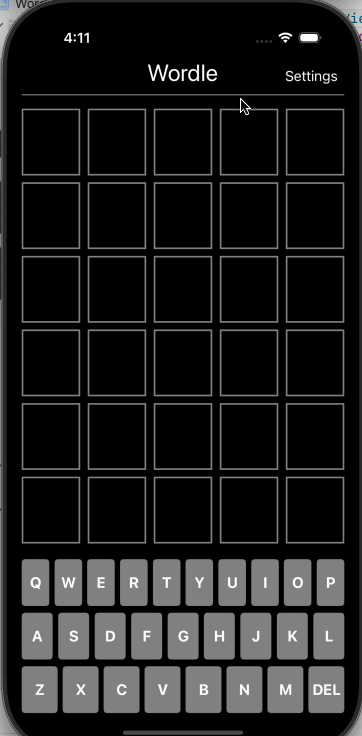

# Project 2 - Wordle Part 2 

Submitted by: Jay Noppone P 

Wordle Part 2 is basically Wordle Part 1, except you have more settings for increasing difficulty, number of guesses, etc.

Time spent: 1 hour spent in total

## Required Features

The following **required** functionality is completed:

- [X] User can change the number of letters per row (the length of the goal word)
- [X] User can change the numbers of rows on the board (how many guesses allowed)
- [X] User can select a new themed set to pull the goal word from
- [X] User can select "alien wordle", causing the goal word to change after each guess

The following **optional** features are implemented:

- [ ] App displays a reset button on the top left to reset the game (but make no changes to the settings)

The following **additional** features are implemented:

- [ ] List anything else that you can get done to improve the app functionality!

## Video Walkthrough

## Notes

Wasn't that challenging, felt easier than the first assignment because instructions were more specific in my opinion.

## License

    Copyright [2025] [Jay Noppone Pornpitaksuk]

    Licensed under the Apache License, Version 2.0 (the "License");
    you may not use this file except in compliance with the License.
    You may obtain a copy of the License at

        http://www.apache.org/licenses/LICENSE-2.0

    Unless required by applicable law or agreed to in writing, software
    distributed under the License is distributed on an "AS IS" BASIS,
    WITHOUT WARRANTIES OR CONDITIONS OF ANY KIND, either express or implied.
    See the License for the specific language governing permissions and
    limitations under the License.
